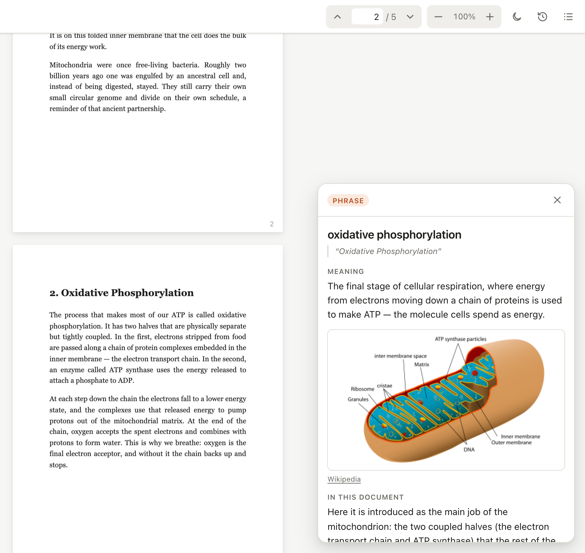
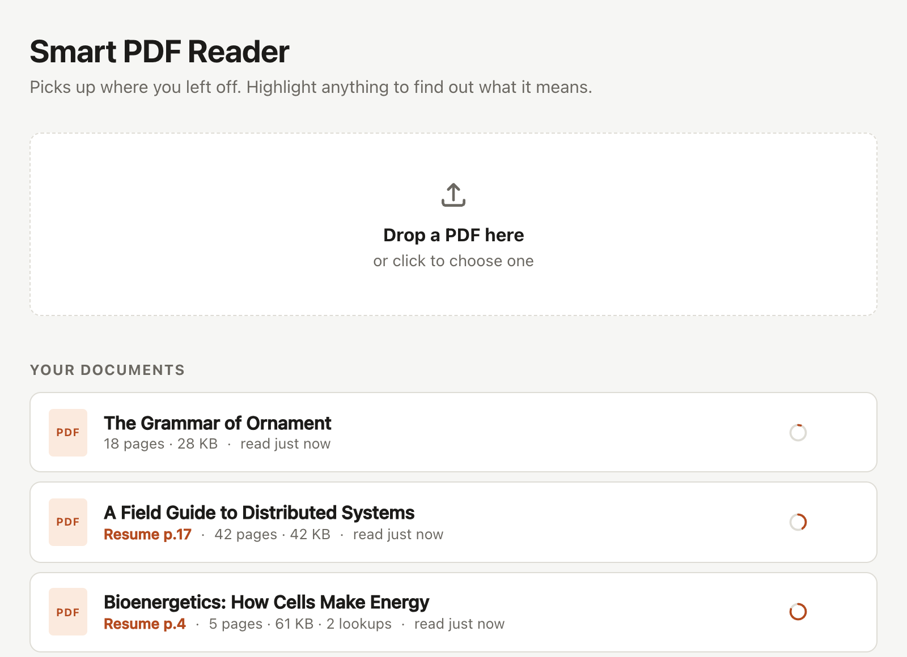
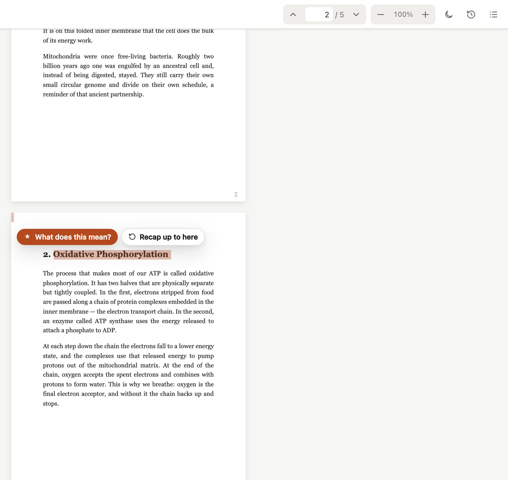
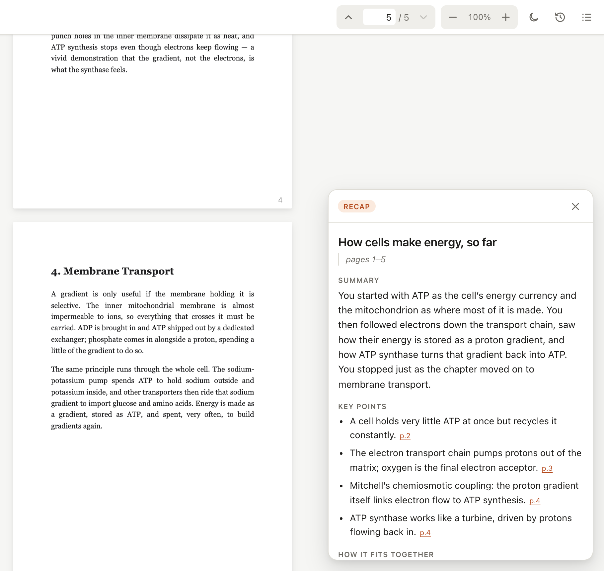
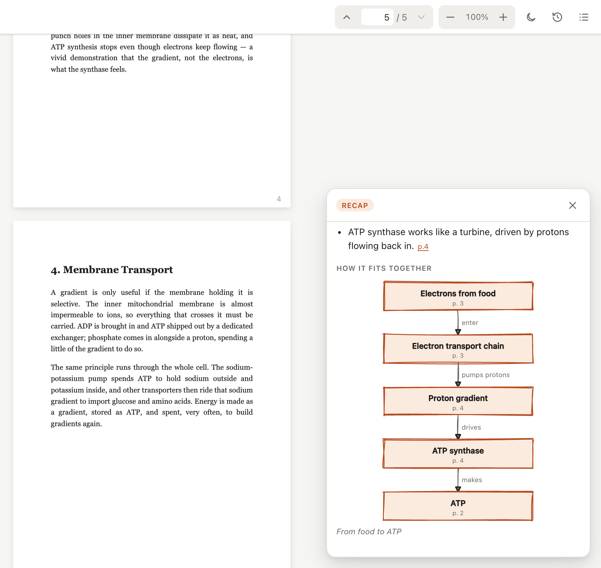
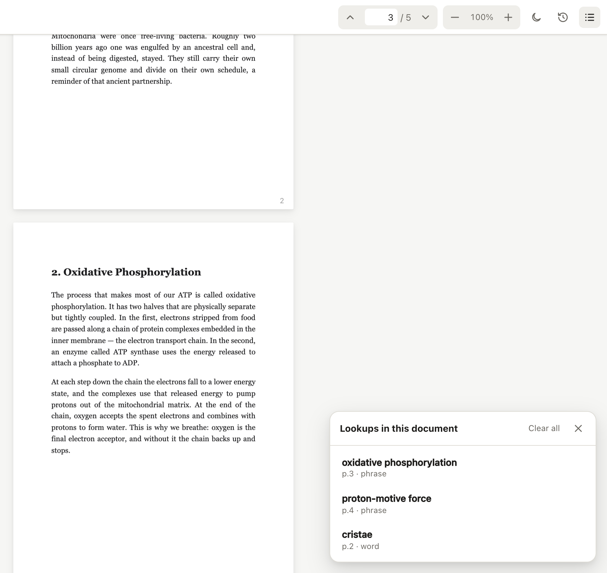
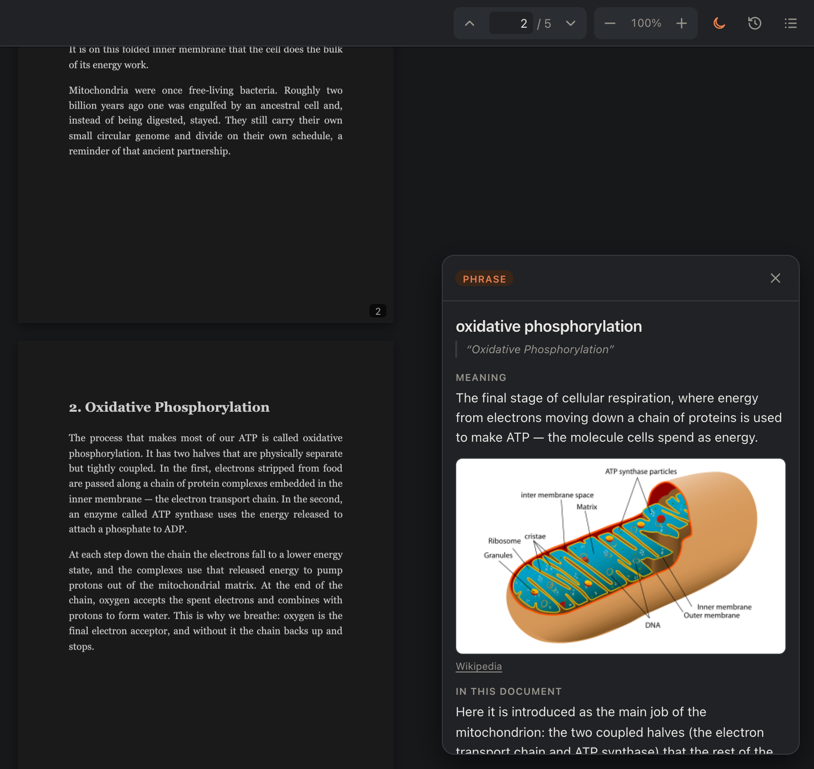
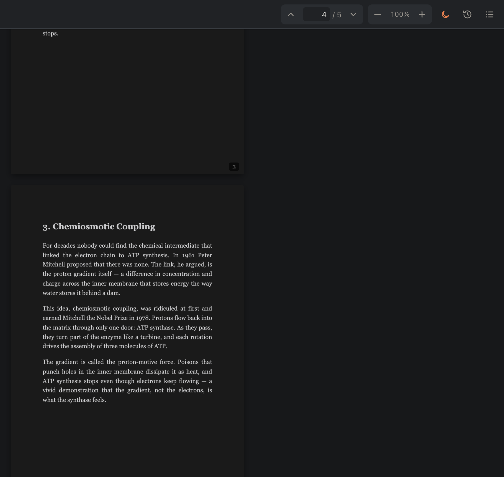

<h1 align="center">📖 Smart PDF Reader</h1>

<p align="center">
  <b>A calm little PDF reader that remembers where you stopped<br>and explains anything you highlight.</b>
</p>

<p align="center">
  
  
  
  
</p>

<p align="center">
  
</p>

---

Reading something hard is easier when you don't have to leave the page. Highlight a word you
don't know and get its meaning, plus what it means *in this book*. Come back after a week away and
ask for a recap of everything so far. Close the tab mid-chapter and it opens right where you were.

Everything runs on your own machine. Your PDFs and reading history never go anywhere except the
AI model you choose, and only the text you ask about.

## ✨ What it does

### 🔖 Picks up where you left off

Your place is saved as you scroll, for each book separately. Reopen it tomorrow and you're back
on the same line. The library shows where you are in each one.

<p align="center">
  
</p>

### 💡 Highlight to understand

Select a word, a phrase or a whole paragraph and press **What does this mean?**

<p align="center">
  
</p>

You get:

- **The meaning:** a plain definition, or for a long passage, an explanation with the jargon unpacked.
- **In this document:** what it means *here*, worked out from the surrounding page.
- **A picture, when one helps.** Things you can look at, like an organelle or a data structure
  usually taught with a diagram, get an image from Wikipedia, Wikimedia Commons or Openverse,
  with credit. Abstract words get no picture, on purpose.

Looking up the same thing twice is instant and free, because answers are cached.

### 🧠 Catch me up

Been away for a while? Press the clock button and choose a range: from the start up to where
you are, up to any page, or up to a line you highlight.

<table>
  <tr>
    <td width="50%"></td>
    <td width="50%"></td>
  </tr>
  <tr>
    <td align="center"><sub>A short summary and key points, each linked to its page</sub></td>
    <td align="center"><sub>…and a hand-drawn sketch of how the ideas connect</sub></td>
  </tr>
</table>

Recaps are saved, so "what I knew at page 40" is always one click away. Long books are
summarised in pieces, and those pieces are reused as you read further, so later recaps cost less.

### 🗂️ Your lookups, remembered

Every lookup is kept for each book. Click one and the reader scrolls to those exact words and
highlights them. Delete them one at a time or clear them all.

<p align="center">
  
</p>

### 🌙 Easy on the eyes at night

The app follows your system's light or dark mode. The moon button also darkens the pages
themselves, so a white PDF doesn't glare at you at midnight.

<table>
  <tr>
    <td width="50%"></td>
    <td width="50%"></td>
  </tr>
</table>

### 🔍 And the small things

- **Trackpad pinch zooms the PDF**, not the browser, around whatever is under your fingers.
- **Big books open instantly.** Pages are drawn only as you reach them, so a 900-page PDF opens as fast as a 5-page one.
- **No duplicates.** Upload the same PDF twice and it just reopens the one you have.

## 🚀 Get started

You'll need **Node.js 22.13 or newer** and a key for one AI provider. A free Gemini key is the easiest.

```bash
npm install
cp .env.example .env     # then paste your key into .env
npm start                # open http://localhost:3210
```

Get a Gemini key at <https://aistudio.google.com/apikey>, then set it in `.env`:

```ini
GEMINI_API_KEY=your-key-here
GEMINI_MODEL=gemini-3.5-flash
PORT=3210
```

Drop a PDF onto the page and start reading. The reader also works with no key at all. You just
get a friendly note instead of an explanation.

### Using a different AI provider

Set that provider's key instead of, or as well as, Gemini's. `LLM_PROVIDER` chooses between them.
Leave it unset and the first provider with a key wins, in the order of this table:

| Provider | Key | Default model |
|---|---|---|
| **Gemini** | `GEMINI_API_KEY` — [get one](https://aistudio.google.com/apikey) | `gemini-3.5-flash` |
| **Mistral** | `MISTRAL_API_KEY` — [get one](https://console.mistral.ai/api-keys) | `mistral-small-latest` |
| **Groq** | `GROQ_API_KEY` — [get one](https://console.groq.com/keys) | `openai/gpt-oss-120b` |
| **OpenRouter** | `OPENROUTER_API_KEY` — [get one](https://openrouter.ai/settings/keys) | `openai/gpt-oss-120b` |
| **NVIDIA NIM** | `NVIDIA_API_KEY` — [get one](https://build.nvidia.com/settings/api-keys) | `deepseek-ai/deepseek-v4.1-flash` |

```ini
LLM_PROVIDER=mistral            # or gemini, groq, openrouter, nvidia
MISTRAL_API_KEY=your-key-here
```

Override any model with `GEMINI_MODEL`, `MISTRAL_MODEL`, `GROQ_MODEL`, `OPENROUTER_MODEL` or
`NVIDIA_MODEL`. `NVIDIA_API_BASE` points at a NIM you host yourself. On OpenRouter, choose a model
that [supports structured outputs](https://openrouter.ai/models?supported_parameters=structured_outputs).
[`.env.example`](.env.example) lists good alternatives for each provider, plus the recap
size settings.

## ⌨️ Handy controls

| Do this | To |
|---|---|
| **Highlight text** | Get an explanation, or a recap up to that line |
| **Scroll** | Your page saves itself |
| 🕘 **Clock button** | *Catch me up*: choose a range, get a recap and a diagram |
| ☰ **List button** | See past lookups, jump to them, delete them |
| 🌙 **Moon button** | Dark pages |
| `←` `→` or type a page number | Jump around |
| **Pinch** on the trackpad | Zoom the PDF |
| `Cmd`/`Ctrl` + `+` `-` `0` | Zoom in, zoom out, back to 100% |
| `Esc` | Close a panel, then leave the book |

## 🔒 Where your stuff lives

- **PDFs** are stored in `pdfs/`.
- **Reading positions, lookups and recaps** are stored in a SQLite file in `data/`.
- **The AI model** only receives the text you highlight, the page around it, or the range you
  ask to recap. Gemini calls send `store: false`. OpenRouter is told to use only upstream providers
  that don't keep prompts.
- **Pictures are fetched by the server** and passed on to your browser, so image sites never see
  what you're reading.

## 🧪 Tests

```bash
npm test
```

This starts the app against a throwaway folder and a fake AI, then drives the real interface in
headless Chrome: upload, resume, highlight-to-explain, recaps, history, zoom and more. It never
touches your library and makes no network calls. It needs Google Chrome, or set `CHROME_PATH`.

## 🛠️ Under the hood

Plain Express on the server and plain JavaScript in the browser, with no build step.
[PDF.js](https://mozilla.github.io/pdf.js/) renders the pages, [rough.js](https://roughjs.com/)
sketches the diagrams, and `node:sqlite` stores everything.

Curious how it works, or want to add a feature? **[docs/ARCHITECTURE.md](docs/ARCHITECTURE.md)**
walks through the code layout and the non-obvious decisions: lazy rendering, how recaps reuse
work, why diagrams are never drawn by the model, and how each AI provider is handled.

## 🌱 Ideas for next

- Highlights that stay on the page
- Notes attached to a selection
- Full-text search
- An "explain this whole page" button
- Export lookups as flashcards

---

<p align="center"><sub>Made for reading hard books without leaving the page. ☕</sub></p>
