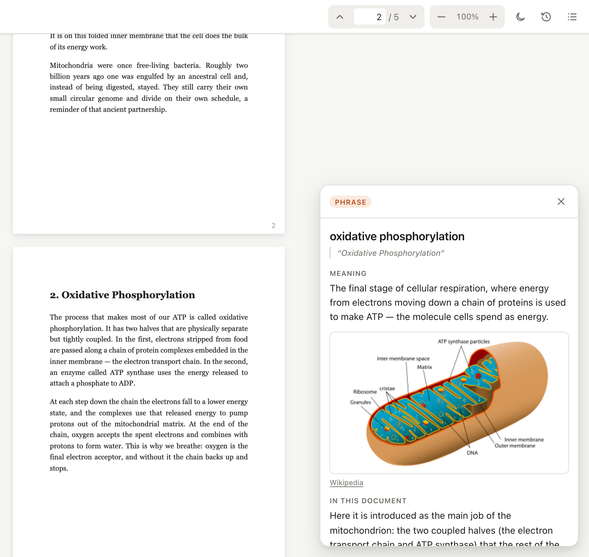
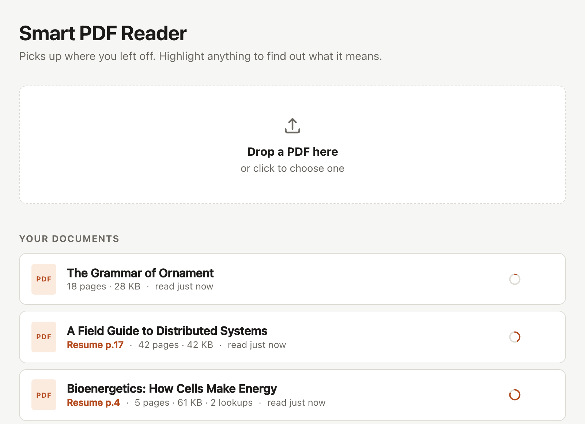
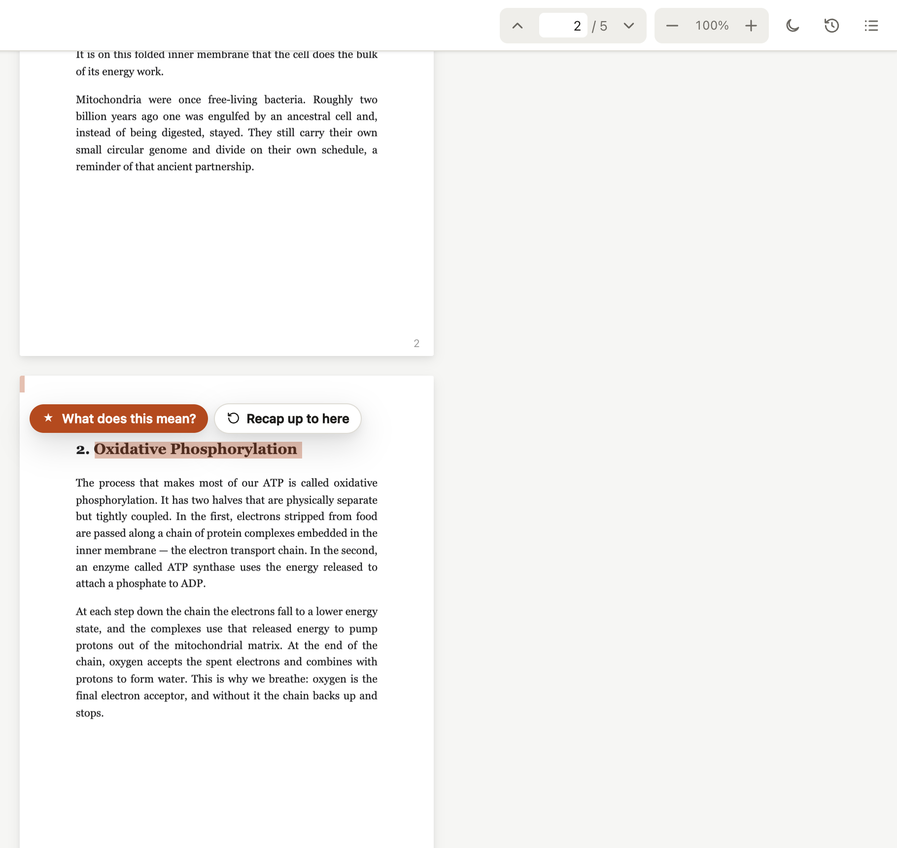
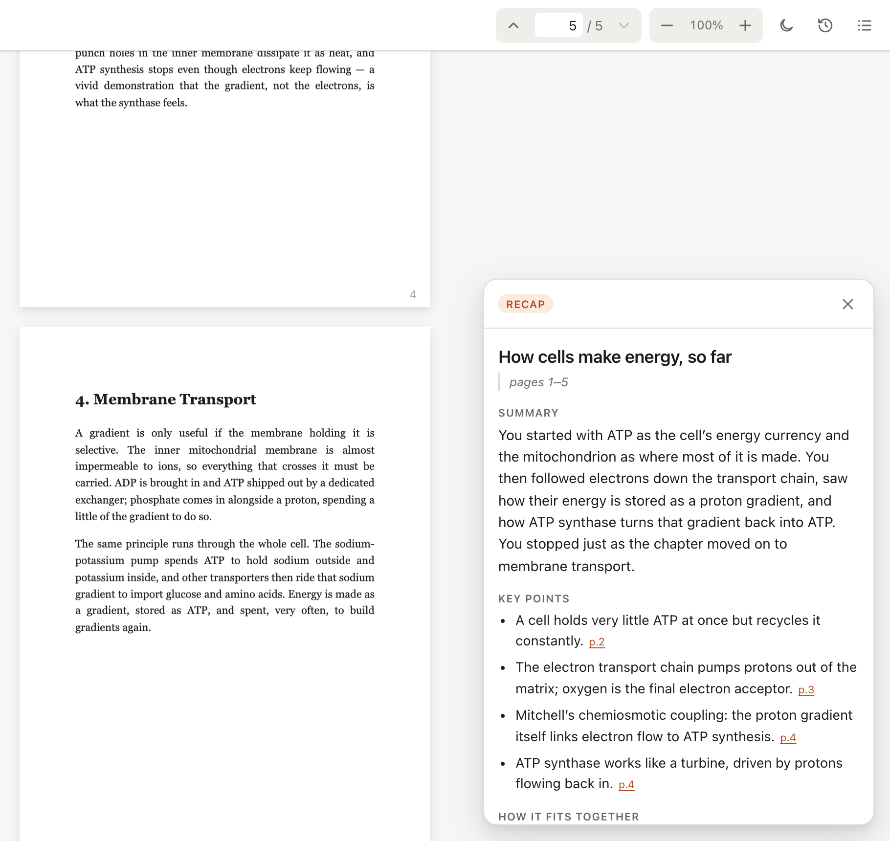
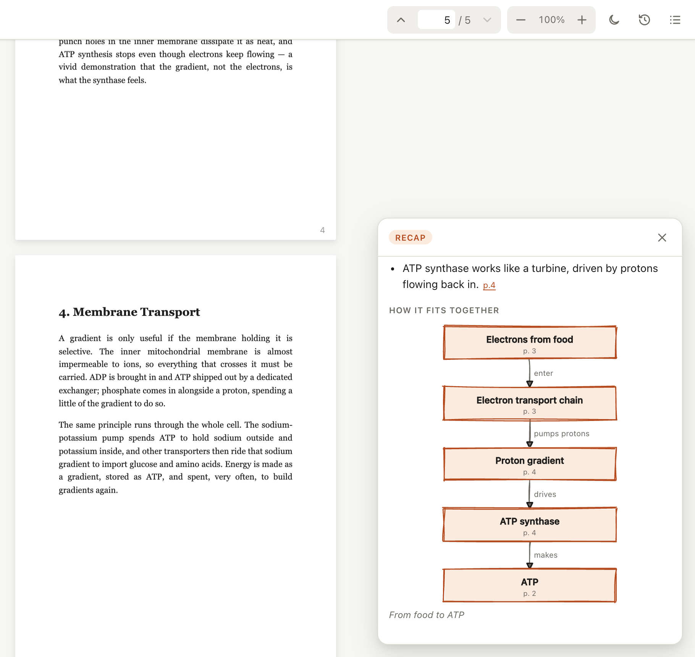
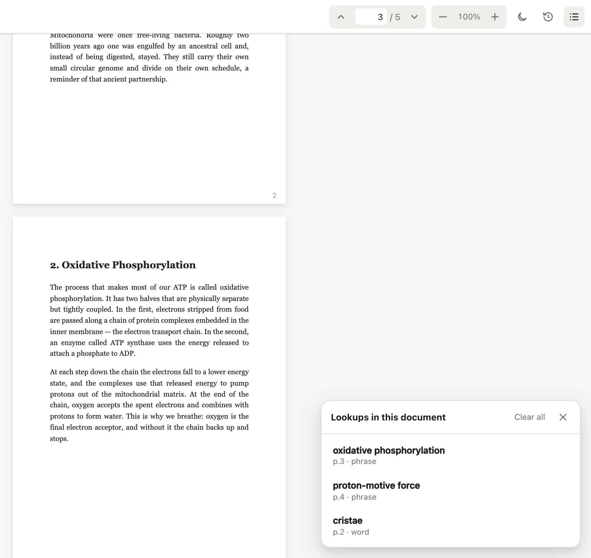
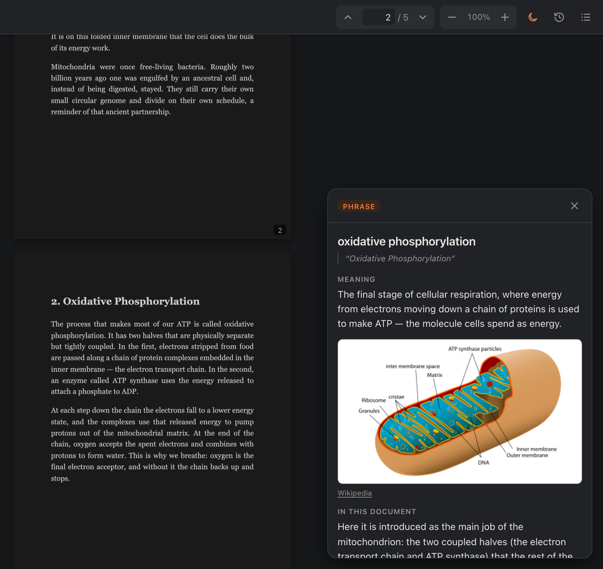
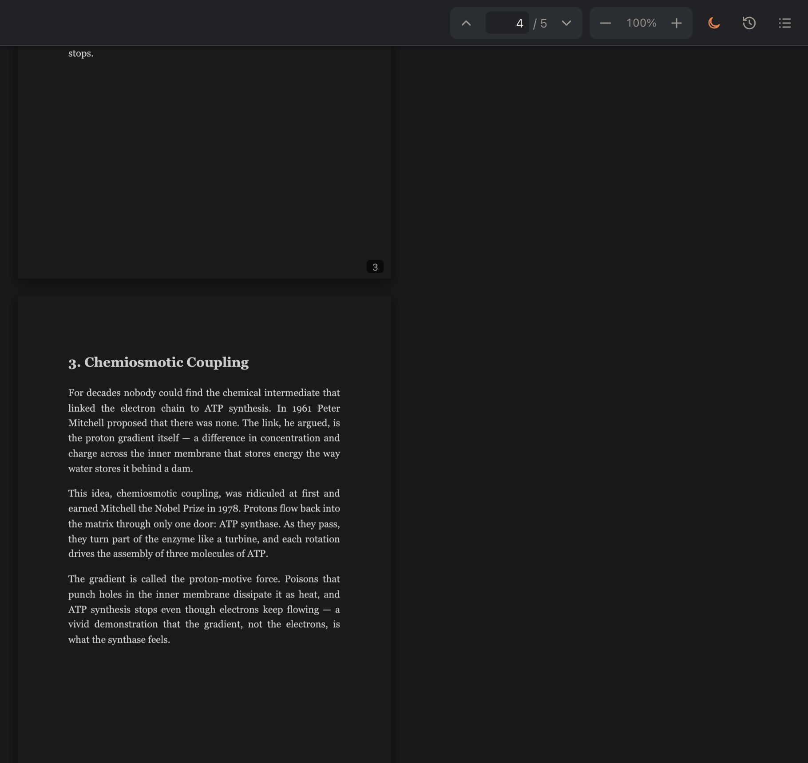

<h1 align="center">📖 Smart PDF Reader</h1>

<p align="center">
  <b>A calm little PDF reader that remembers where you stopped<br>and explains anything you highlight.</b>
</p>

<p align="center">
  
  
  
  
</p>

<p align="center">
  
</p>

---

Reading something hard is easier when you don't have to leave the page. Highlight a word you
don't know and get its meaning, plus what it means *in this book*. Come back after a week away and
ask for a recap of everything so far. Stuck on a dense section? Turn it into a mind map. Tired
eyes? Let it read to you while a highlight follows along. Close the tab mid-chapter and it opens
right where you were.

Everything runs on your own machine. Your PDFs and reading history never go anywhere except the
AI model you choose, and only the text you ask about.

## ✨ What it does

### 🔖 Picks up where you left off

Your place is saved as you scroll, for each book separately. Reopen it tomorrow and you're back
on the same line. The library shows where you are in each one.

<p align="center">
  
</p>

### 💡 Highlight to understand

Select a word, a phrase or a whole paragraph and press **What does this mean?**

<p align="center">
  
</p>

You get:

- **The meaning:** a plain definition, or for a long passage, an explanation with the jargon unpacked.
- **In this document:** what it means *here*, worked out from the surrounding page.
- **A picture, when one helps.** Things you can look at, like an organelle or a data structure
  usually taught with a diagram, get an image from Wikipedia, Wikimedia Commons or Openverse,
  with credit. Abstract words get no picture, on purpose.

Looking up the same thing twice is instant and free, because answers are cached.

### 🕸️ Map out a passage

Select a paragraph or a whole section and press **Mind map**. You get a hand-drawn map of it:
the topic in the middle, its main ideas on either side, and the details under each one. It's a
quick way to see how a dense passage is put together before you read it closely.

The button shows up only when you select a dozen words or more, because a word or a short
phrase has nothing to map. Mapping the same passage again is instant, because maps are cached too.

### 🧠 Catch me up

Been away for a while? Press the clock button and choose a range: from the start up to where
you are, up to any page, or up to a line you highlight.

<table>
  <tr>
    <td width="50%"></td>
    <td width="50%"></td>
  </tr>
  <tr>
    <td align="center"><sub>A short summary and key points, each linked to its page</sub></td>
    <td align="center"><sub>…and a hand-drawn sketch of how the ideas connect</sub></td>
  </tr>
</table>

Recaps are saved, so "what I knew at page 40" is always one click away. Long books are
summarised in pieces, and those pieces are reused as you read further, so later recaps cost less.

### 🗂️ Your lookups, remembered

Every lookup is kept for each book. Click one and the reader scrolls to those exact words and
highlights them. Delete them one at a time or clear them all.

<p align="center">
  
</p>

### 🎯 A tracker that keeps your pace

Press the tracker button (or `t`) and click any word. A soft highlight moves along the line
one word at a time, hops down to the next line with a little bounce, and scrolls the page
for you so the line you're on stays in the same spot on screen.

- **Set your speed** from 100 to 800 words per minute with the slider or `[` `]`. The speed is remembered.
- **It reads like a person.** It rests a little longer on long words and at the end of a sentence.
- **Scroll yourself and it pauses.** Press `Space` and it glides back to where it was.
- **It keeps up with zoom**, pinch included, and moves on to the next page by itself.

If your system is set to reduce motion, the bounce is turned off.

### 🔊 Listen along

With the tracker on, press the speaker button (or `v`) and a natural-sounding voice reads the
page aloud. The highlight follows the voice word by word, and a sentence runs straight on
over the page turn.

- **It reads what you'd read out loud.** Page numbers, footnote marks and citations like
  `[7, 8, 9]` are skipped. Headings get a pause of their own instead of running into the paragraph.
  Words hyphenated at the end of a line are said whole.
- **It speaks at a speaking pace.** Reading aloud has its own speed, 175 words per minute to
  start, from 100 to 325. While it's reading, the slider and `[` `]` change the voice, not your
  silent-reading speed.
- **Pick a voice.** A menu in the tracker bar offers seven, American and British. Your choice is
  remembered.
- **Pause, and it picks up the sentence again.** `Space` stops it mid-sentence. Press it again and
  the voice starts that sentence over, with no wait.

The voice is [Kokoro](https://huggingface.co/hexgrad/Kokoro-82M), a small open model that runs on
your own machine. Nothing you read is sent anywhere for it, and it costs nothing. The first time
you use it, it downloads once (about 90 MB, into `models/`) while the tracker bar shows its
progress. After that it works offline. If it can't load, your system's own voice reads instead.

### ✏️ Write on the page

Press the pen button (or `d`) and draw straight on the PDF: underline a line, circle a word,
scribble in the margin. Your ink belongs to the page, so it stays put when you zoom, scroll away
or come back next week.

- **Pen, highlighter and eraser,** with five colours for each and three thicknesses. The
  highlighter tints the paper without hiding the words. The eraser rubs out whole strokes.
- **A scratch pad beside the book.** The notepad button (or `n`) opens a blank sheet next to
  the pages, one for each book, that grows as you write. The pages stay readable and selectable
  while you use it.
- **Pen pressure.** With a drawing tablet, the line gets thicker the harder you press. A mouse
  or trackpad draws an even line.
- **It saves itself.** Each stroke is saved half a second after you lift the pen. Close the tab
  inside that half second and the browser asks before letting you go.

Using a pen tablet such as an XP-Pen? Install its driver, allow it under **System Settings →
Privacy & Security** (both *Accessibility* and *Input Monitoring* on a Mac), restart Chrome, and
map the tablet to the screen Chrome is on. Hold the pen's side button to erase.

### 🌙 Easy on the eyes at night

The app follows your system's light or dark mode. The moon button also darkens the pages
themselves, so a white PDF doesn't glare at you at midnight.

<table>
  <tr>
    <td width="50%"></td>
    <td width="50%"></td>
  </tr>
</table>

### 🔍 And the small things

- **Trackpad pinch zooms the PDF**, not the browser, around whatever is under your fingers.
- **Big books open instantly.** Pages are drawn only as you reach them, so a 900-page PDF opens as fast as a 5-page one.
- **No duplicates.** Upload the same PDF twice and it just reopens the one you have.

## 🚀 Get started

You'll need **Node.js 22.13 or newer** and a key for one AI provider. A free Gemini key is the easiest.

```bash
npm install
cp .env.example .env     # then paste your key into .env
npm start                # open http://localhost:3210
```

Get a Gemini key at <https://aistudio.google.com/apikey>, then set it in `.env`:

```ini
GEMINI_API_KEY=your-key-here
GEMINI_MODEL=gemini-3.5-flash
PORT=3210
```

Drop a PDF onto the page and start reading. The reader also works with no key at all. You just
get a friendly note instead of an explanation.

Only this machine can connect. To open it from your phone on the same Wi-Fi, set
`HOST=0.0.0.0` in `.env`, but know that anyone on that network can then use it.

Reading aloud needs no key. `npm install` brings in the voice engine, a few hundred MB in
`node_modules`, and the voice model downloads the first time you press the speaker button. To
leave it to your browser's voices instead, set `TTS_ENGINE=off` in `.env`.

### Using a different AI provider

Set that provider's key instead of, or as well as, Gemini's. `LLM_PROVIDER` chooses between them.
Leave it unset and the first provider with a key wins, in the order of this table:

| Provider | Key | Default model |
|---|---|---|
| **Gemini** | `GEMINI_API_KEY` — [get one](https://aistudio.google.com/apikey) | `gemini-3.5-flash` |
| **Mistral** | `MISTRAL_API_KEY` — [get one](https://console.mistral.ai/api-keys) | `mistral-small-latest` |
| **Groq** | `GROQ_API_KEY` — [get one](https://console.groq.com/keys) | `openai/gpt-oss-120b` |
| **OpenRouter** | `OPENROUTER_API_KEY` — [get one](https://openrouter.ai/settings/keys) | `openai/gpt-oss-120b` |
| **NVIDIA NIM** | `NVIDIA_API_KEY` — [get one](https://build.nvidia.com/settings/api-keys) | `deepseek-ai/deepseek-v4.1-flash` |

```ini
LLM_PROVIDER=mistral            # or gemini, groq, openrouter, nvidia
MISTRAL_API_KEY=your-key-here
```

Override any model with `GEMINI_MODEL`, `MISTRAL_MODEL`, `GROQ_MODEL`, `OPENROUTER_MODEL` or
`NVIDIA_MODEL`. `NVIDIA_API_BASE` points at a NIM you host yourself. On OpenRouter, choose a model
that [supports structured outputs](https://openrouter.ai/models?supported_parameters=structured_outputs).
[`.env.example`](.env.example) lists good alternatives for each provider, plus the recap
size settings and the read-aloud ones (engine, starting voice, model precision, where the model
is kept).

### 🔐 Sign-in

To open the reader from anywhere but this machine, turn on sign-in so only the people you choose
get in. It's behind a flag and off unless you turn it on:

```ini
AUTH=google
GOOGLE_CLIENT_ID=1234567890-abc.apps.googleusercontent.com
GOOGLE_CLIENT_SECRET=your-client-secret
ALLOWED_EMAILS=you@gmail.com, friend@gmail.com
PUBLIC_URL=https://reader.example.com   # the address people open; defaults to http://localhost:3210
```

People sign in with Google, and only the addresses in `ALLOWED_EMAILS` get past the sign-in
page. That covers everything: the library, the PDFs themselves and every API call. Everyone you
let in shares the one library and your AI key.

To get the client ID and secret:

1. Open <https://console.cloud.google.com> and create a project (any name).
2. Go to **Google Auth Platform** (in older menus: *APIs & Services → OAuth consent screen*):
   - **Branding:** an app name and your email as the support address.
   - **Audience:** *External*, and leave it in **Testing**. Add each person who should get in as
     a **test user**. In Testing, Google itself only lets test users sign in, so your list is
     enforced twice.
3. Go to **Clients → Create client**, choose **Web application**, and add your `PUBLIC_URL`
   followed by `/auth/callback` as an **authorized redirect URI**. To try it on this machine first,
   that's `http://localhost:3210/auth/callback`.
4. Copy the **client ID** and **client secret** into `.env`.

The app asks only for your email address (`openid email`), so Google doesn't need to review it.
With `AUTH=google` it won't start until every setting is there, and a `PUBLIC_URL` other than
localhost must be `https://`. To turn sign-in off again, remove `AUTH=google` or set `AUTH=off`.

## ⌨️ Handy controls

| Do this | To |
|---|---|
| **Highlight text** | Get an explanation, a mind map of the passage, or a recap up to that line |
| **Scroll** | Your page saves itself |
| 🕘 **Clock button** | *Catch me up*: choose a range, get a recap and a diagram |
| ☰ **List button** | See past lookups, jump to them, delete them |
| 🌙 **Moon button** | Dark pages |
| 🎯 **Tracker button** or `t` | Turn the reading tracker on, then click a word to start |
| `Space` | Play or pause the tracker (while it's on) |
| `[` `]` | Tracker slower or faster, or the voice while it's reading aloud |
| 🔊 **Speaker button** or `v` | Read aloud along with the tracker; pick a voice from the menu beside it |
| ✏️ **Pen button** or `d` | Draw on the pages |
| 🗒️ **Notepad button** or `n` | Open or close the scratch pad |
| `p` `h` `e` | Pen, highlighter, eraser (while the drawing tools are showing) |
| `1` `2` `3` | Fine, medium or bold line |
| `Cmd`/`Ctrl` + `Z`, add `Shift` to redo | Undo or redo a stroke |
| `f` | Full screen |
| `←` `→` or type a page number | Jump around |
| **Pinch** on the trackpad | Zoom the PDF |
| `Cmd`/`Ctrl` + `+` `-` `0` | Zoom in, zoom out, back to 100% |
| `Esc` | Close a panel, put the pen down, turn off the tracker, then leave the book |

## 🔒 Where your stuff lives

- **PDFs** are stored in `pdfs/`.
- **Reading positions, lookups, recaps and drawings** are stored in a SQLite file in `data/`.
- **The AI model** only receives the text you highlight or map, the page around it, or the range
  you ask to recap. Gemini calls send `store: false`. OpenRouter is told to use only upstream
  providers that don't keep prompts.
- **Reading aloud happens on your machine.** The voice model is kept in `models/`, and the text it
  reads never leaves your computer. Your speeds, voice and on/off choice are saved in the
  browser.
- **Pictures are fetched by the server** and passed on to your browser, so image sites never see
  what you're reading.
- **With sign-in on**, Google tells the app your email address and nothing else. Sessions are
  kept in the same SQLite file and last 30 days; signing out ends yours on the server too.

## 🧪 Tests

```bash
npm test
```

This starts the app against a throwaway folder and a fake AI, then drives the real interface in
headless Chrome: upload, resume, highlight-to-explain, mind maps, recaps, history, zoom, the
reading tracker, reading aloud, drawing with a mouse and a simulated pen, and more. A stand-in voice answers with a muted tone, so the voice
model is never loaded. It never touches your library and makes no network calls. It needs
Google Chrome, or set `CHROME_PATH`.

## 🛠️ Under the hood

Plain Express on the server and plain JavaScript in the browser, with no build step.
[PDF.js](https://mozilla.github.io/pdf.js/) renders the pages, [rough.js](https://roughjs.com/)
sketches the diagrams and mind maps, [kokoro-js](https://www.npmjs.com/package/kokoro-js)
reads aloud, [perfect-freehand](https://github.com/steveruizok/perfect-freehand) shapes pen
strokes, and `node:sqlite` stores everything.

Curious how it works, or want to add a feature? **[docs/ARCHITECTURE.md](docs/ARCHITECTURE.md)**
walks through the code layout and the non-obvious decisions: lazy rendering, how recaps reuse
work, why diagrams and mind maps are never drawn by the model, how each AI provider is
handled, and how the highlight keeps time with a voice that never says where it is.

## 🌱 Ideas for next

- Highlights that snap to the selected text
- Typed notes attached to a selection
- Full-text search
- An "explain this whole page" button
- Export lookups as flashcards

---

<p align="center"><sub>Made for reading hard books without leaving the page. ☕</sub></p>
